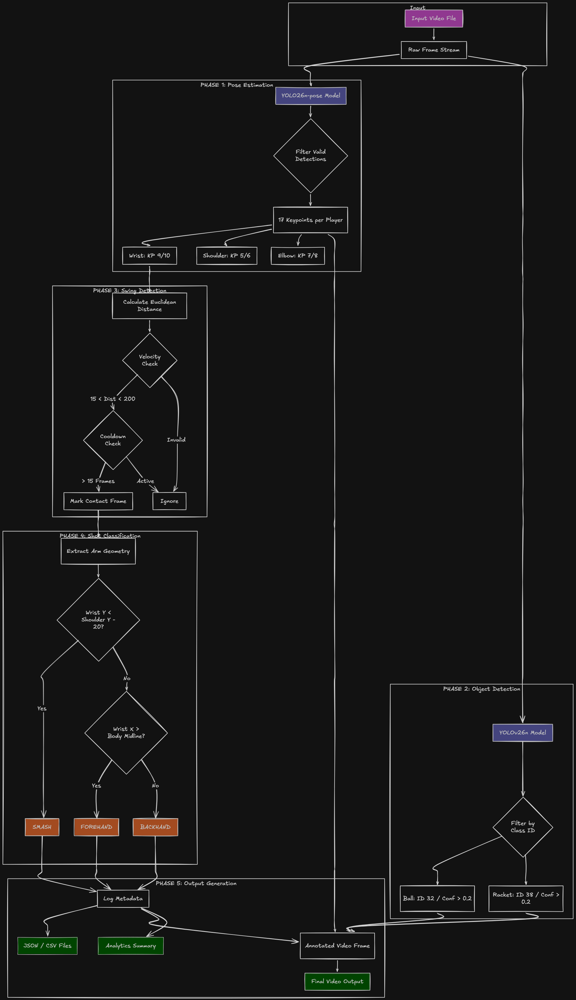
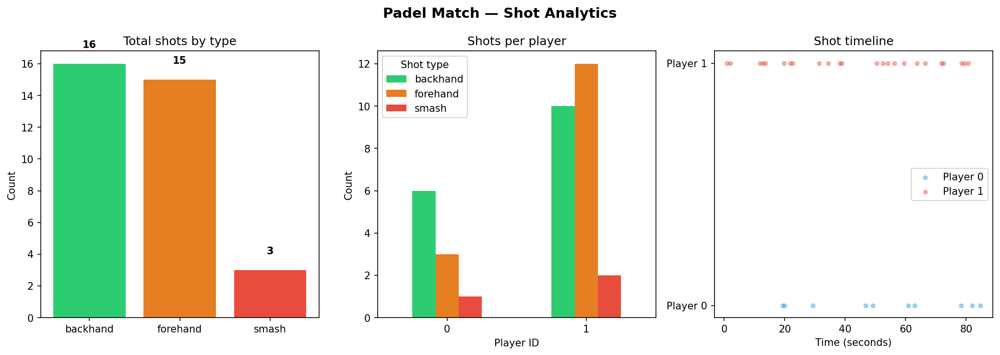

# Padel Game Analytics — Shot Classification System

## Overview
This project analyzes padel match footage using computer vision to detect players,
track movement, and classify shot types (forehand, backhand, smash) in real time.
Built as part of the Layman AI internship assignment.

## Methodology


The system processes video in five sequential phases:

### Phase 1: Pose Estimation
- **Model:** YOLO26n-pose (pretrained on COCO dataset)
- **Input:** Raw video frames
- **Process:**
  - Run inference on each frame to detect all players
  - Extract 17 body keypoints per detected player
  - Filter out invalid detections
- **Key Keypoints Extracted:**
  - Keypoints 5, 6: Left and right shoulder
  - Keypoints 7, 8: Left and right elbow
  - Keypoints 9, 10: Left and right wrist
- **Output:** Normalized keypoint coordinates (x, y) per player per frame

### Phase 2: Object Detection (Ball & Racket)
- **Model:** YOLO26n (general object detection)
- **Input:** Raw video frames (parallel to Phase 1)
- **Process:**
  - Run inference to detect all objects in frame
  - Filter detections by class ID with confidence threshold
  - Ball: Class ID 32 (confidence > 0.2)
  - Racket: Class ID 38 (confidence > 0.2)
- **Output:** Bounding boxes and metadata for ball and racket

### Phase 3: Swing Detection (Contact Frame Identification)
For each player, detect "contact frames" where an actual swing occurs:
- **Velocity Calculation:** Compute Euclidean distance of right wrist between consecutive frames
  - Formula: distance = √((x_curr − x_prev)² + (y_curr − y_prev)²)
- **Velocity Check:** Filter by valid swing range
  - If 55 < distance < 200 pixels → Potential swing
  - Outside this range → Reject (too slow or tracking error)
- **Cooldown Check:** Prevent duplicate detections
  - Minimum 15 frames must pass since last logged shot
  - If passed → Mark as contact frame; else → Ignore
- **Output:** Contact frame index and timestamp

### Phase 4: Shot Classification
At each contact frame, extract arm geometry and apply hierarchical rules:
- **Rule 1 (Smash):** 
  - If right_wrist_y < (right_shoulder_y − 20 pixels)
  - Indicates arm raised high above shoulder
- **Rule 2 (Forehand):** 
  - Else if right_wrist_x > body_midline
  - Body midline = (left_shoulder_x + right_shoulder_x) / 2
  - Indicates wrist to the right of body center
- **Rule 3 (Backhand):** 
  - Else (right_wrist_x < body_midline)
  - Indicates wrist to the left of body center
- **Output:** Shot type (forehand, backhand, or smash)

### Phase 5: Output Generation
For each detected shot, log metadata and generate visualizations:
- **Data Logged:**
  - Frame number, timestamp, player ID, shot type, wrist velocity
  - Saved to shots.json (structured) and shots.csv (tabular)
- **Annotated Video:**
  - Skeleton overlay for all detected players
  - Ball detections drawn as yellow circles with confidence
  - Racket detections drawn as purple bounding boxes
  - Shot type labels (FOREHAND/BACKHAND/SMASH) displayed for 20 frames after detection
  - Frame counter and running shot count in corner
- **Analytics Summary:**
  - Total shots per player
  - Shot type breakdown by player
  - Overall shot statistics

## Results (on sample video)
- Output video can be viewed on this link [Output video](https://drive.google.com/file/d/1D57sq6-l_HfxiPaq-zDkJzKhijQQqMR5/view?usp=sharing)
- Total shots detected: 41
- Player 0: 3 forehands, 6 backhands, 1 smashes
- Player 1: 12 forehands, 10 backhands, 2 smashes
- Player 2: 3 forehands, 2 backhands, 4 smashes

## Analytics


## Challenges Faced
1. Inconsistent pose determination
The pretrained yolo26n-pose model couldnt consistently track the position of shoulder, elbow and wrist.

2. Couldn't detect ball and racket
The pretrained Yolo model couldnt properly identify ball and racket because of small pixel size.

3. Ghost detections 
The model couldnt estimate the pose of all the persons present in the frame. But Rather it showed some other objects as person i.e Ghost detections

## What could have been better?
1. The model could be finetuned on the frames of this video by manual annotation for better pose estimation
2. Currently I assumed that all the players plays with right hand. Detection of which hand does the player uses could have been done automatically. 
3. The min_velociy and max_velocity threshold could be properly optimized for more accurate shot detections.

## Setup

### Requirements
1. create a virtual environment
```python
python -m venv virtual_environment_name
```

2. Activate virtual environment
```python
# windows
virtual_environment_name\scripts\activate

# mac
virtual_environment_name\bin\activate
```

3. Install all dependencies
```python
pip install -r requirements.txt
```

4. How to Run
```bash
# 1. Run full shot classification pipeline
python main.py

# 2. Generate analytics charts
python analytics.py
```

### Folder Structure
- Make sure your folder looks like this
- if any one of this is missing then you can use this [Download Link](https://drive.google.com/drive/folders/1SQxTUa4GnERG3AKN3ytlaEyuv-CiGBtM?usp=sharing)

padel_analytics/
├── input/
│   └── infernce_sample_video.mp4
|── models/
|   └── yolo26n-pose.pt
|   └── yolo26n.pt
|
├── output/
│   ├── annotated_output.mp4
│   ├── shots.json
│   ├── shots.csv
│   └── analytics.png
├── main.py
├── analytics.py
└── README.md


## Tech Stack
- Python 3.11
- YOLO26 (Ultralytics) — player detection and pose estimation
- OpenCV — video reading, frame processing, output video writing
- NumPy — keypoint math, angle calculation, velocity calculation
- Pandas — structured output to CSV
- Matplotlib — analytics charts


